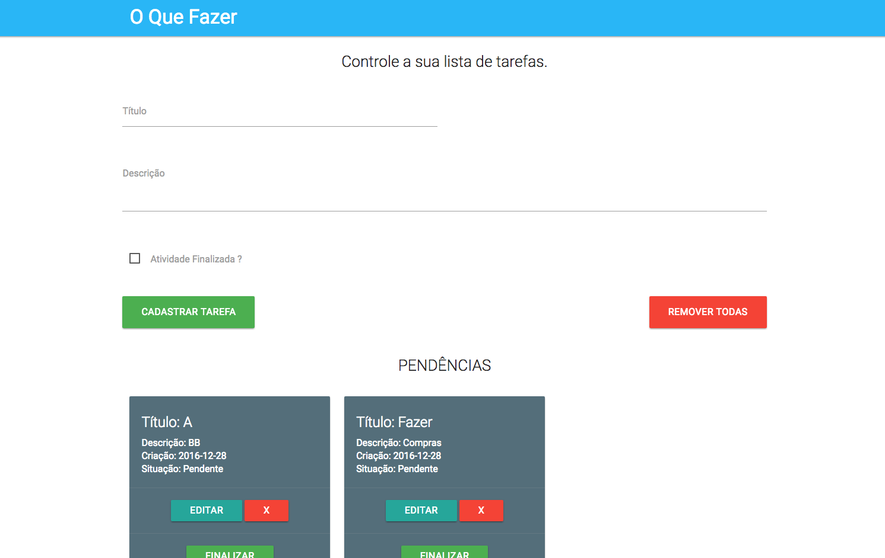

# Projeto para cadastro de atividades

### Importante

Este projeto é apenas um estudo de caso simples, que pode melhorar, eu foquei no essencial do projeto, cadastrar as atividades, mudar o status das mesmas, listar e excluir. Como melhorias futuras podem existir diálogos de confirmação nas ações de exclusão geral ou por atividade, opção de data com calendário, paginação etc.

Esta aplicação possui URL com retornos no padrão JSON (JavaScript Object Notation), não fiz uso de nenhuma lib para API REST, em virtude do tempo, mas é tranquilo por exemplo fazer o uso do djangorestframework ou algo do tipo.

### Deploy no Heroku

* https://oquefazer.herokuapp.com/

### Executando 1 dinamo gratuito no Heroku

0. entre no diretório root  da aplicação `cd pasta_raiz_do_projeto`
0. execute `heroku login`
0. informe suas credenciais
0. envie suas modificações para o master no Heroku `git push heroku master`
0. execute `heroku ps:scale web=1`

### Dependências

0. Python 2.7.x
0. Django 1.9.x
0. Materialize
0. JQuery
0. Angular JS 1.x

### Execute o projeto com o comando abaixo

0. git clone no projeto.

### Instalando bibliotecas com pip

0. entre no diretório root da aplicação `cd pasta_raiz_do_projeto`
0. execute `pip install -r requirements.txt`

### Para rodar alguns testes de view para a aplicação

0. entre no diretório root da aplicação `cd pasta_raiz_do_projeto`
0. execute `python manage.py test lista`.

### Instalando bibliotecas do frontend com bower (nesse projeto estou utilizando o CDN)

0. instale o [bower](http://bower.io/)
0. entre no diretório root da aplicação `cd pasta_raiz_do_projeto` onde encontra-se o `bower.json`
0. execute `bower install`
0. após isso faça as alterações nos imports das libs que estão no template `templates/inicial.html`

### Para rodar a aplicação

0. entre no diretório root da aplicação `cd pasta_raiz_do_projeto`
0. execute `python manage.py runserver 0.0.0.0:8000`.
0. acesso pelo navegado `http://0.0.0.0:8000` ou `http://IP_ATUAL:8000`.

### Tela inicial do Projeto

